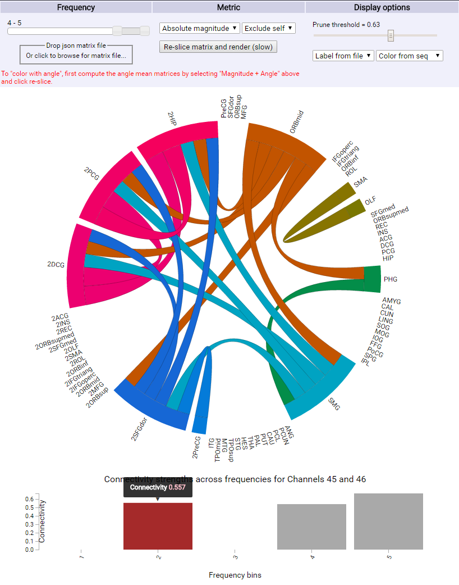

# fp-davidjuliancaldwell-jamesbrains

See link below for visualization

http://cse512-16s.github.io/fp-davidjuliancaldwell-jamesbrains/

===============

## Team Members

1. David Caldwell (davidjuliancaldwell)
3. James Wu (jamesbrains)

## Visualization of Brain Connectivity 

## Breakdown

A breakdown of how the work was split among the group members and a commentary on the research/development process.

---- If you decide not to put these info in the project page put them down here -----

## Project

This is an example repository for the final project submission.  Put your abstract from your final paper here.

[Poster](https://github.com/CSE512-16S/fp-davidjuliancaldwell-jamesbrains/raw/master/final/poster-davidjuliancaldwell-jamesbrains.pdf),
[Final Paper](https://github.com/CSE512-16S/fp-davidjuliancaldwell-jamesbrains/raw/master/final/paper-davidjuliancaldwell-jamesbrains.pdf)

## Running Instructions

Follow the link below to run the visualization

http://cse512-16s.github.io/fp-davidjuliancaldwell-jamesbrains/

Or download the repository, and run (if you have python 3) `python -m http.server 8888` and access this from http://localhost:8888/ . If you have python 2, run `python -m SimpleHTTPServer 8888` and access this from http://localhost:8888/ .
